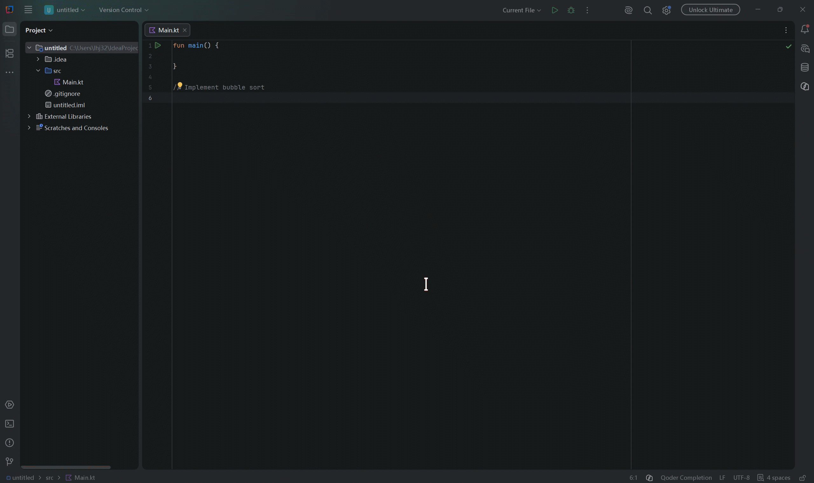
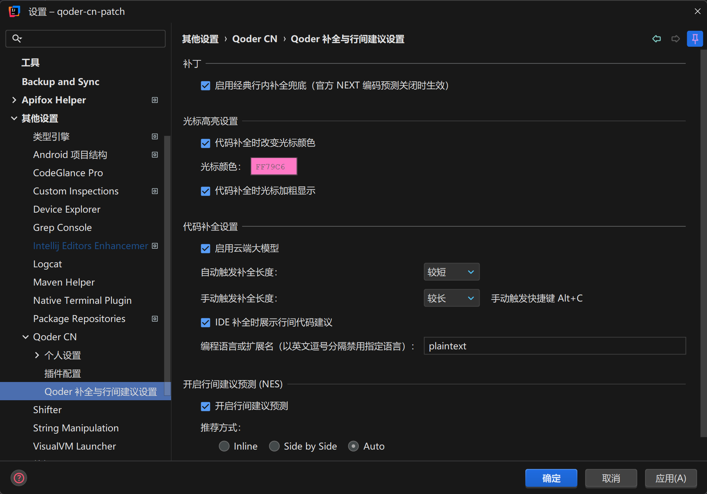

# qoder-cn-patch

[](https://github.com/MirminaMirror/qoder-cn-patch/releases/latest)
[](https://github.com/MirminaMirror/qoder-cn-patch/releases)
[](https://github.com/MirminaMirror/qoder-cn-patch/actions/workflows/build.yml)
[](LICENSE)
[](https://plugins.jetbrains.com/)
[](https://lingma.aliyun.com/)

🛠️ **Qoder CN (通义灵码) JetBrains 插件功能修复与增强伴生插件（Companion Plugin）**

针对 Qoder CN 新版（`2026.814` 等）相较于旧版（`3.3.5`）被官方移除 / 主动禁用的核心功能，
以**零字节码修改**的伴生插件方式恢复：声明 `depends` 依赖官方插件，直接复用官方保留的
补全管线（`InlayPreviewRequest` → `completionWithDebouncer` → `DefaultInlayCompletionCollector`）。


---
## 📸 效果演示 (Preview)

### 1. 🎬 行内补全与连环预测（动态演示）

<p align="center">
  
</p>

> **效果说明**：
> - **打字自动补全**：关闭官方 NEXT 编码预测后，输入打字即可即时唤起灰色行内代码补全建议；
> - **Tab 连环预测**：按 `Tab` 键采纳建议后，立即无缝预测并提示下一行代码；
> - **状态栏入口**：编辑器右下角状态栏常驻 `Qoder Completion` 入口，点击直达配置面板。

### 2. ⚙️ 补全与 NES 设置面板（完整恢复）

<p align="center">
  
</p>

> **配置说明**：
> - **设置树挂载**：挂载于 `Settings → Other Settings → Qoder CN → Qoder 补全与行间建议设置`；
> - **代码补全配置**：完整恢复云端大模型开关、自动/手动触发补全长度、IDE 补全联动与禁用语言列表；
> - **NES 建议预测**：完整恢复行间建议预测开关、推荐方式（Inline / Side by Side / Auto）与代码移动；
> - **光标高亮定制**：支持代码补全期间自定义光标高亮颜色（取色器支持）与加粗显示；
> - **补丁总开关**：支持一键启停经典行内补全兜底机制。

---


## ✨ 修复与恢复的功能清单

### 行内代码补全（核心断流恢复）

官方 2026.814 删除了 `CosyInlayManagerImpl.editorChanged` 的经典补全分支与
`CosyCommandListener.triggerCompletion`，并将 `CosyConfig.useNewNesFeature()` 开关整体移除，
导致打字自动补全与 Alt+P 手动补全全部断流。本插件：

1. **打字自动补全**（`QoderClassicCompletionListener`）：
   - 按项目注册 `CommandListener`，忠实还原官方 3.3.5 `triggerCompletion` 调度语义：
     打字命令（`Typing` / `输入`，含中文 IME）→ 文档真实变更 → 无起始选区 →
     无活动 Live Template → Lookup 允许 → 直调 `InlayPreviewRequest.generate(AUTO)`。
   - **仅当官方 NEXT 编码预测关闭时介入**（`!InlineEditUtil.isEnableNEXT()`），
     NEXT 开启时官方 `triggerCompletionNesCombination` 链路自洽，插件保持静默，避免双重渲染。
2. **手动触发补全**：`Alt + C`（`QoderTriggerInlayAction`）直调
   `InlayPreviewRequest.generate(MANUAL)`，绕过被断流的 `editorChanged`；
   官方失效的 Alt+P 保持原样不冲突。
3. **Tab 采纳后下一行预测**：捕获采纳写命令 `Apply Tongyi Inline Suggestion`，
   调用官方孤儿方法 `NextCompletionRequest.triggerNext`（对应 3.3.5 ACCEPT 非 NEXT 分支）。
4. **光标移动预热**：纯光标移动命令后 `triggerCursorPreCompletion` + 浮层清理（官方语义）。

### 设置界面

5. **完整恢复「代码补全设置」面板**（挂载在官方 `qodercn.settings` 设置树下）：
   云端大模型开关、自动 / 手动触发补全长度（行级 / 较短 / 较长 / 超长 / 关闭）、
   IDE 补全时展示行间建议、禁用语言列表；`apply` 后经 `Cosy.updateConfig` 实时推送后端。
6. **完整恢复「行间建议预测 (NES)」面板**：开关、推荐方式 (Inline / Side by Side / Auto)、代码移动。
7. **补丁兜底总开关**：可一键停用插件全部补全介入逻辑（`isModified` 基于表单快照精确判定，
   不再恒真）。

### 菜单与状态栏

8. **右键上下文菜单**：恢复「优化代码 (Alt+Shift+O)」「生成代码注释 (Alt+Shift+V)」
   「生成单元测试 (Alt+Shift+U)」「解释代码 (Alt+Shift+P)」，委托官方保留的 Action ID。
9. **框选代码对话按钮**（`QoderSelectionPopupAction`）：官方类 `CosySelectionPopupAction`
   与 `InlayCompletionHintFactory.showChatButtonAtCaret` 均保留但注册被注释禁用，此处直调恢复。
10. **状态栏设置入口**（`QoderPatchStatusBarWidget`）：替代被官方整体删除的
    `CosyCompletionTitleDisplayAction`，一键直达补丁设置面板。

---

## 📦 下载与安装指南

### ⚠️ 前置要求
使用本伴生插件前，请确保您的 IDE 中已安装官方 **Qoder CN (通义灵码) `2026.814+`** 插件（本插件声明了对 `com.alibabacloud.intellij.cosy` 的运行时依赖）。

---

### 方式一：下载预编译包安装（推荐）

1. 前往 **[GitHub Releases 最新发布页](https://github.com/MirminaMirror/qoder-cn-patch/releases/latest)** 下载最新版本的 `qoder-cn-patch-x.y.z.zip` 发行包；
2. 打开 JetBrains IDE，进入设置：**Settings / Preferences** (`Ctrl + Alt + S` / `Cmd + ,`)；
3. 导航至 **Plugins** 页面，点击右上角的齿轮设置图标 ⚙️，选择 **Install Plugin from Disk...**；
4. 选中下载的 `qoder-cn-patch-x.y.z.zip` 文件并确认，随后**重启 IDE** 即可完成安装。

> **生效与触发说明**：
> - **打字自动补全兜底**：当官方设置中 **NEXT 编码预测处于关闭状态** 时自动生效；若开启 NEXT，则由官方预测链路处理，本插件自动静默。
> - **手动触发补全**：随时可通过快捷键 **`Alt + C`**（macOS 上为 `Option + C`）强制唤起行内补全。

---

### 方式二：从源码构建与沙盒调试（开发者）

如果您希望自行编译或参与开发：

```bash
# 1. 克隆代码仓库
git clone https://github.com/MirminaMirror/qoder-cn-patch.git
cd qoder-cn-patch

# 2. 构建插件发布包（产物位于 build/distributions/qoder-cn-patch-*.zip）
# Windows
.\gradlew.bat buildPlugin
# macOS / Linux
./gradlew buildPlugin

# 3. 启动预装官方 Qoder 的沙盒 IDE 进行交互式调试
# Windows
.\gradlew.bat runIde
# macOS / Linux
./gradlew runIde
```
---

## 🧪 验证清单（沙盒实测）

1. 官方设置中关闭 NEXT → 打字出现灰色行内补全 → Tab 采纳 → 出现下一行预测。
2. `Alt + C` 手动触发补全。
3. Settings → Qoder CN → Completion & NES Settings 面板加载 / 修改 / Apply 生效。
4. 编辑器右键菜单四项功能可用；框选代码后右键出现「框选代码对话」。
5. 状态栏出现 "Qoder Completion" 入口，点击直达设置面板。

---
## ❓ 常见问题排查 (FAQ / Troubleshooting)

### Q1: 打字时为什么没有出现灰色行内补全代码？
请依次排查以下设置项：
1. **检查官方 NEXT 预测状态**：打开 `Settings → Qoder CN → 插件配置`，确认 **「NEXT 设置」中的「启用 NEXT (编码预测)」处于未勾选（关闭）状态**（当官方 NEXT 开启时，由官方预测链路接管，本伴生插件自动保持静默以避免双重渲染）；
2. **检查补丁总开关**：打开 `Settings → Other Settings → Qoder CN → Qoder 补全与行间建议设置`，确认已勾选 **「启用经典行内补全兜底」**；
3. **检查当前输入上下文**：当前处于代码模板编辑（Live Template 占位符跳转中）或存在选区时，IDE 会暂停补全触发；
4. **手动快捷键测试**：在代码行任意位置按下 **`Alt + C`**（macOS 上为 `Option + C`），观察是否能成功唤起灰色行内建议。若手动可出建议但打字不出，通常为 NEXT 状态或语言过滤设置问题。

---

### Q2: 手动触发快捷键 `Alt + C` 与其他插件或系统快捷键冲突？
您可以随时在 IDE 中自定义该快捷键：
1. 打开 **Settings / Preferences** (`Ctrl + Alt + S` / `Cmd + ,`) → 导航至 **Keymap**；
2. 在右上角搜索框中输入：`触发 Qoder 行内补全/Trigger Qoder Inline Completion`；
3. 右键该 Action → 选择 **Add Keyboard Shortcut**，录入您习惯的任意快捷键组合保存即可。

---

### Q3: 右键菜单中没有显示「优化代码 / 生成注释 / 单元测试」？
1. 请确保 IDE 已安装并启用了官方 **Qoder CN (通义灵码)** 插件；
2. 该类右键动作仅在当前处于**有效代码编辑器且有焦点**时展示；
3. 若官方已卸载或版本不匹配，相关菜单项会自动安全隐藏。

---

### Q4: 官方 Qoder 插件后续自动升级，本插件会受影响吗？
本插件采用**非侵入式伴生设计（Companion Plugin）**，未修改官方任何 jar 包与字节码，仅依赖官方导出的稳定平台扩展点与公共 API。只要官方未进行破坏性的底层协议重构，伴生插件将长期稳定运行；若未来遇到官方协议变动，请关注 [GitHub Releases](https://github.com/MirminaMirror/qoder-cn-patch/releases) 更新或提交 Issue。

---


## 📄 免责声明与商标说明 (Disclaimer & Trademarks)

### 免责声明
本项目为独立的第三方开源伴生扩展插件（Companion Plugin），旨在为开发者提供功能自修复与开发体验增强，**与阿里巴巴集团、阿里云计算有限公司或通义灵码（Qoder）官方团队无任何隶属、合作或商业关联**。

本项目基于官方插件公开导出的公共接口（API）与 IntelliJ Platform 扩展点机制进行声明式交互，不包含、不修改亦不逆向分发任何官方私有源码或二进制执行文件。用户在遵循双方软件许可的前提下自行承担使用本插件的全部风险。

### 商标声明
“通义灵码”、“Qoder”、“Alibaba Cloud”、“阿里云”及相关图形标识均为阿里巴巴集团控股有限公司或其关联公司的注册商标。本项目中提及上述名称与标识仅用于客观描述插件的适用对象、兼容版本与功能定位，不构成对上述商标的商业使用授权或任何官方背书保证。

---

## 📜 开源许可证 (License)

本项目采用 [Apache License 2.0](LICENSE) 协议开源。
